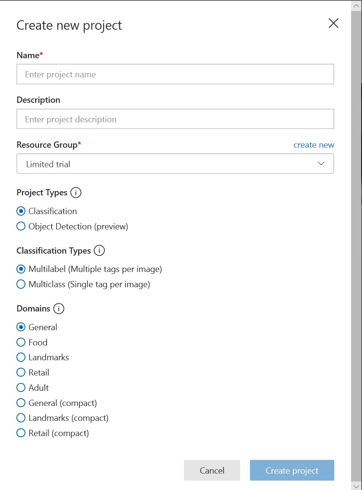
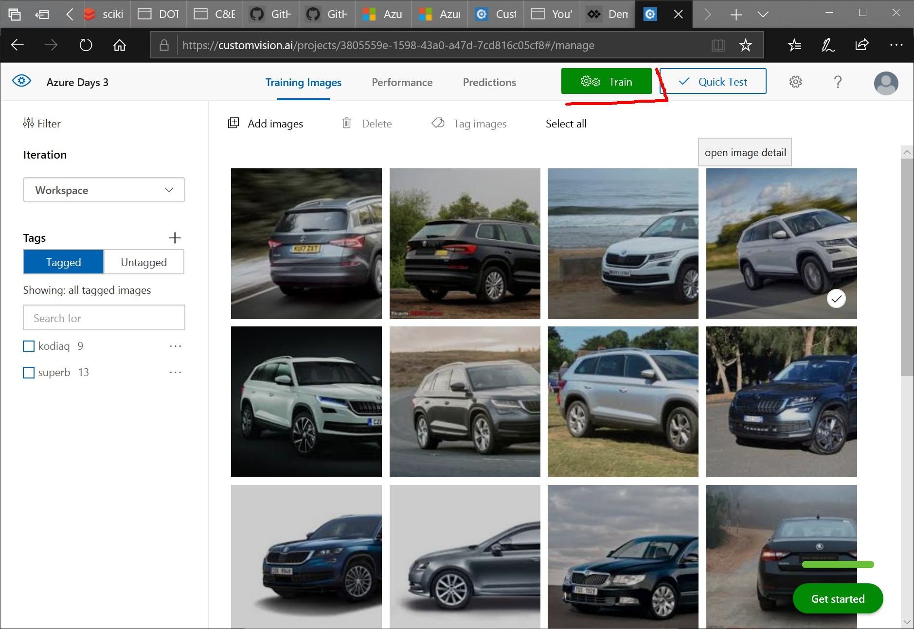
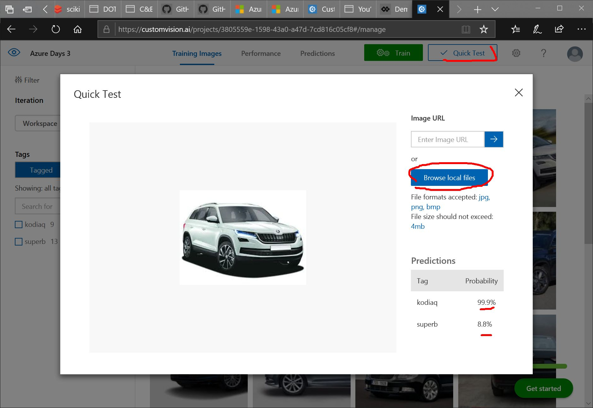
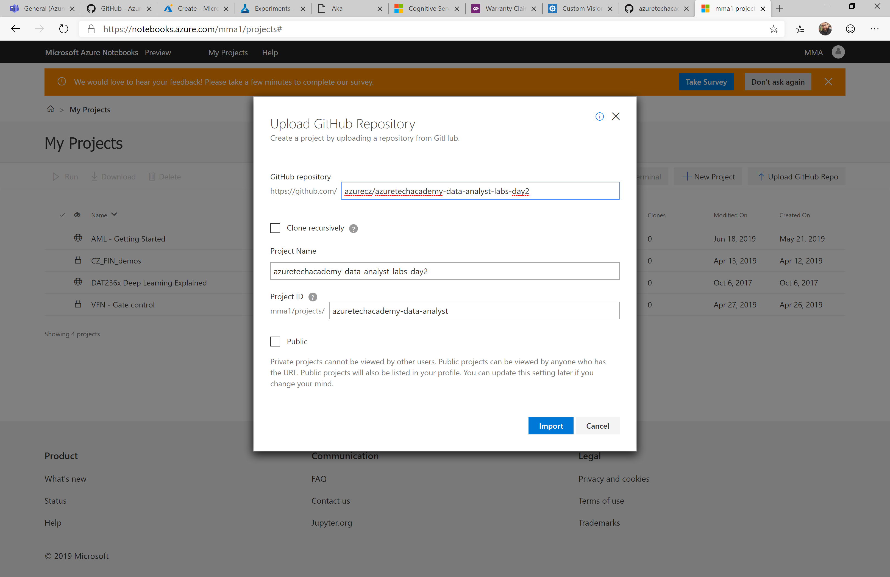
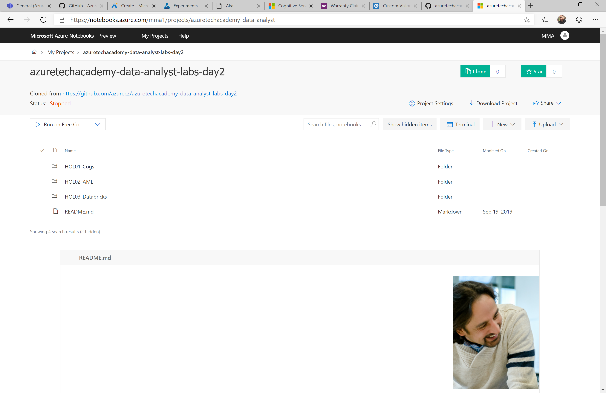
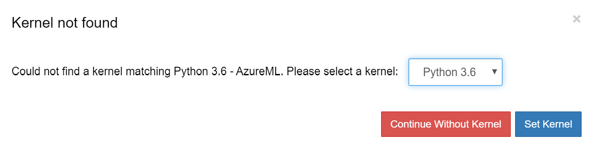
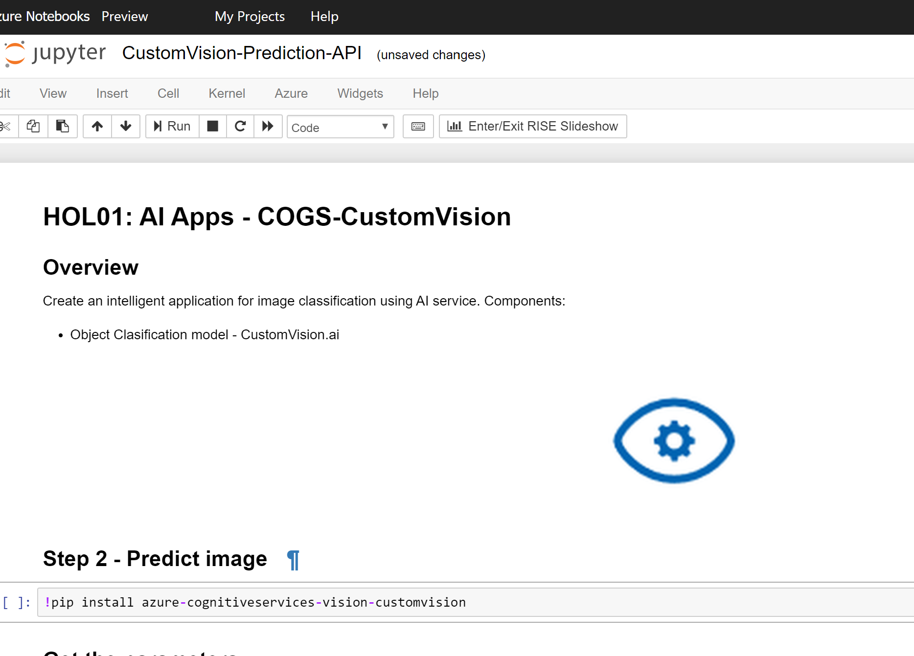
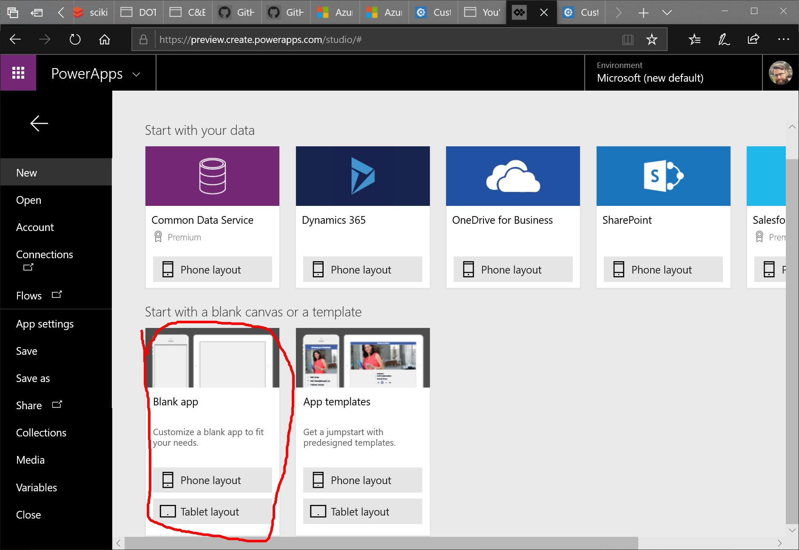
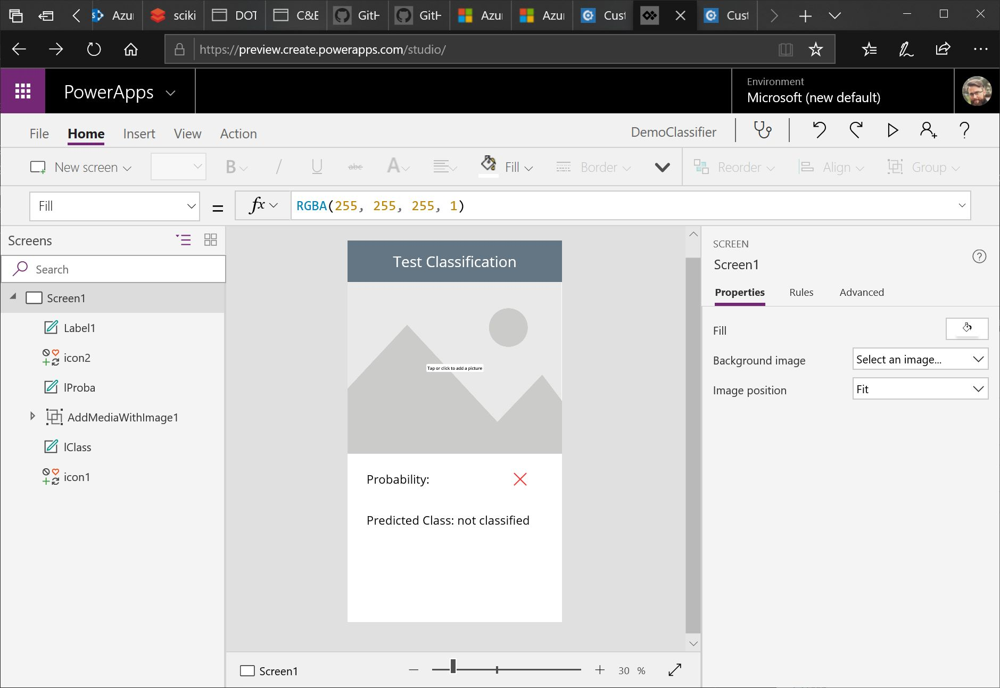
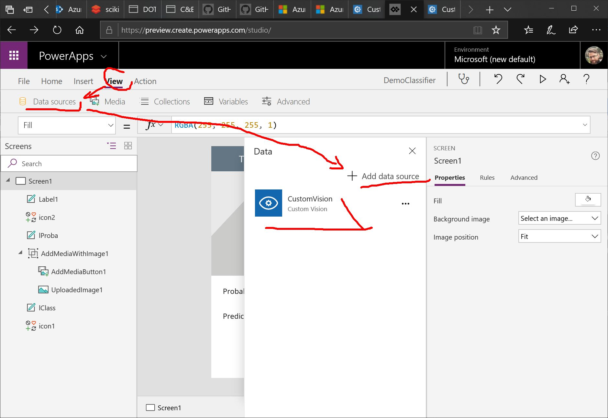

# Day#2 – AI & ML

# HOL01: AI Apps - COGS-CustomVision-PowerApps

## Overview
Create an intelligent application for image classification using AI service. Components:
- Object Clasification model - CustomVision.ai
- PowerApps application to call the object classification serivce and display results

## Prerequisitites 
- Microsoft Azure account
- Microsoft O365 account (PowerApps access)
- images to classification (at least 15 per category)

## Guide
### 1. CustomVision (https://cusomvision.ai)
1. create CustomVision project - classification (select Multiclass - from Classification types choices)

1. upload images - get data from [zip file](./Cars.zip)
1. label / tag images to separate classes within CustomVision portal
1. run training!

1. quick test with one of the test images

You have now created a first model for car classification.

### 2. Test the created model by callin Custom Vision API

1. Go to [https://notebooks.azure.com/](https://notebooks.azure.com/) and log in with your Azure credentials.
1. Go to My Projects (upper left)
1. Import Git Repo (`azurecz/azuretechacademy-data-analyst-labs-day2`)

1. check the import was successfull

1. go to `HOL01-Cogs` folder and select [Jupyter Notebook] `CustomVision-Prediction-API.ipynb` in `HOL1-Cogs` folder and follow the steps. 

> note: if you see error for missing kernell select Python 3.6

> note: change first code cell from `!/data/anaconda/envs/py36/bin/pip install azure-cognitiveservices-vision-customvision` to `!pip install azure-cognitiveservices-vision-customvision`

### [OPTIONAL] 2. PowerApps (https://powerapps.microsoft.com)
1. create PowerApps application - phone layout

2. add elements: labels, media

3. add CustomVision as datasource [prediction key]

4. select "AddMediaButton1" and put into `OnChange` action scoring the image (use your CustomVision project ID insted of `xxx...`): 
`UpdateContext({res:CustomVision.PredictImage("xxxxxxxx-xxxx-xxx-xxxx-xxxxxx", UploadedImage1).Predictions})`

5. update label property to update text based on results (text): `Concatenate("Probability: ",Text(First(res).Probability))`
6. save & publish the app

