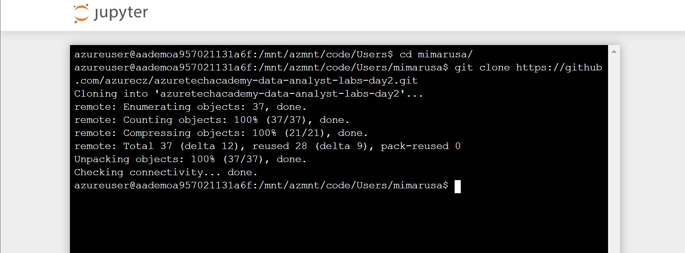

# Day#2 – AI & ML

# HOL02: Azure Machine Learning service

- create workspace (5min)
- create ntb (5min)
- part1 - data (15min)
- part2 - train locally (15min)
- part3 - train on remote automl (35min)
- part4 - deployment (25min)

## PREREQUISITIES

## Create a workspace

A workspace is a foundational resource in the cloud that you use to experiment, train, and deploy machine learning models. It ties your Azure subscription and resource group to an easily consumed object in the SDK. If you already have an Azure Machine Learning service workspace, skip to the [next section](#azure). Otherwise, create one now.

1. Sign in to the [Azure portal](https://portal.azure.com/) by using the credentials for the Azure subscription you use. 

1. In the upper-left corner of Azure portal, select **+ Create a resource**.

1. Use the search bar to find **Machine Learning service workspace**.

1. Select **Machine Learning service workspace**.

1. In the **Machine Learning service workspace** pane, select **Create** to begin.

1. Configure your new workspace by providing the workspace name, subscription, resource group, and location.

   Field|Description 
   ---|---
   Workspace name |Enter a unique name that identifies your workspace. In this example, we use **docs-ws**. Names must be unique across the resource group. Use a name that's easy to recall and to differentiate from workspaces created by others.  
   Subscription |Select the Azure subscription that you want to use.
   Resource group | Use an existing resource group in your subscription or enter a name to create a new resource group. A resource group holds related resources for an Azure solution. In this example, we use **docs-aml**. 
   Location | Select the location closest to your users and the data resources to create your workspace.

1. After you are finished configuring the workspace, select **Create**. 

   It can take a few moments to create the workspace.

   When the process is finished, a deployment success message appears. To view the new workspace, select **Go to resource**.

## Create a cloud notebook server

This example uses the cloud notebook server in your workspace for an install-free and pre-configured experience. Use [your own environment](how-to-configure-environment.md#local) if you prefer to have control over your environment, packages and dependencies.

From your workspace, you create a cloud resource to get started using Jupyter notebooks. This resource is a cloud-based Linux virtual machine pre-configured with everything you need to run Azure Machine Learning service.

1. Open your workspace in the [Azure portal](https://portal.azure.com/).  If you're not sure how to locate your workspace in the portal, see how to [find your workspace](how-to-manage-workspace.md#view).

1. On your workspace page in the Azure portal, select **Notebook VMs** on the left.

1. Select **+New** to create a notebook VM.

     

1. Provide a name for your VM. Then select **Create**.

    > [!NOTE]
    > Your Notebook VM name must be between 2 to 16 characters. Valid characters are letters, digits, and the - character.  The name must also be unique across your Azure subscription.

1. Wait until the status changes to **Running**.

### Launch Jupyter web interface

After your VM is running, use the **Notebook VMs** section to launch the Jupyter web interface.

1. Select **Jupyter** in the **URI** column for your VM.

    

    The link starts your notebook server and opens the Jupyter notebook webpage in a new browser tab.  This link will only work for the person who creates the VM. Each user of the workspace must create their own VM.

1. On the Jupyter notebook webpage, the top foldername is your username.  Select this folder.

    > [!TIP]
    > This folder is located on the [storage container](concept-workspace.md#resources) in your workspace rather than on the notebook VM itself.  You can delete the notebook VM and still keep all your work.  When you create a new notebook VM later, it will load this same folder. If you share your workspace with others, they will see your folder and you will see theirs.

In **next part** of the lab you download a git repo.

## Download the GitHub repo with the Lab contents

1. Navigate to you folder in Jupyter (it is your username) and select New->Terminal
 

1. Clone the GitHub repository for this lab in the terminal

`cd *<your_username>*`

`git clone https://github.com/azurecz/azuretechacademy-data-analyst-labs-day2.git`

After that you should see something similar:

1. Go to lab notebook:
`HOL-Azure Machine Learning service.ipynb` in HOL02-AML folder in the cloned repo.

