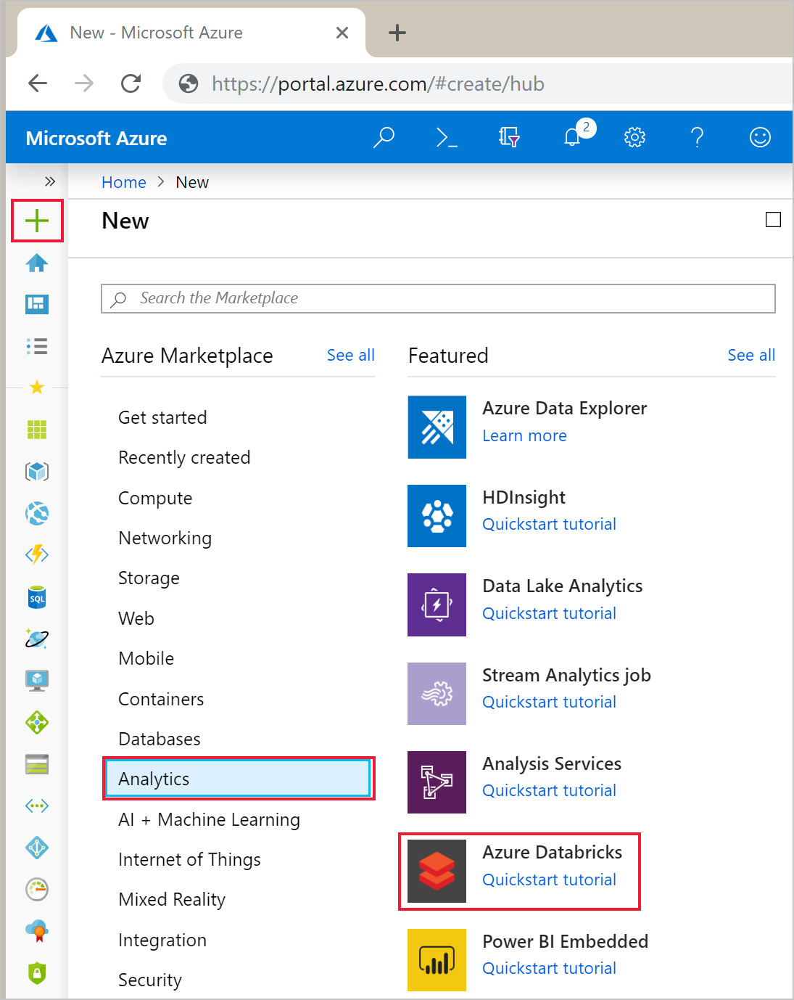
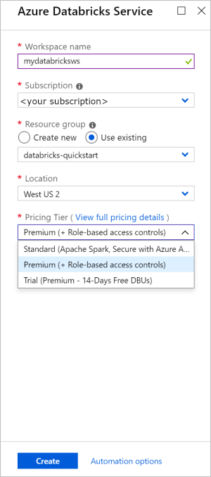
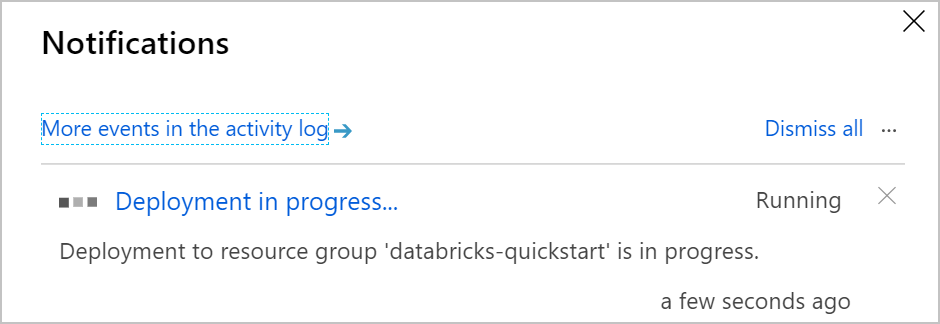
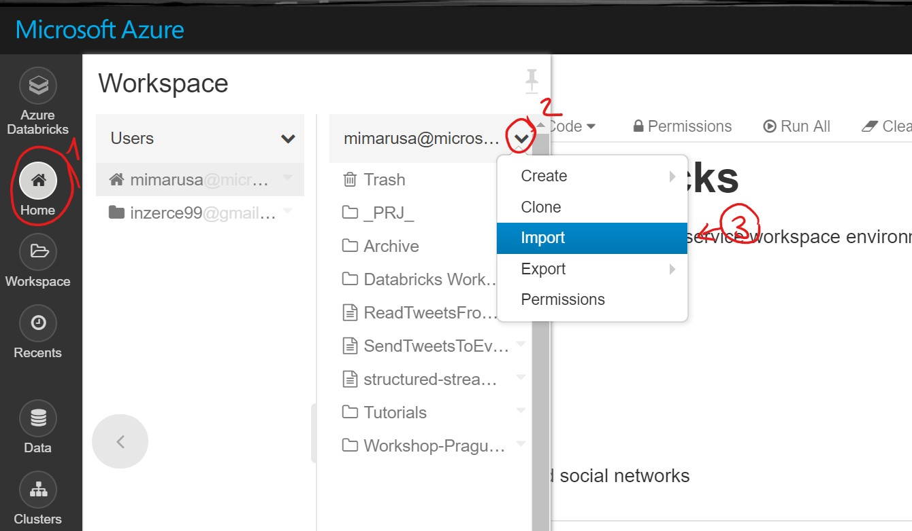
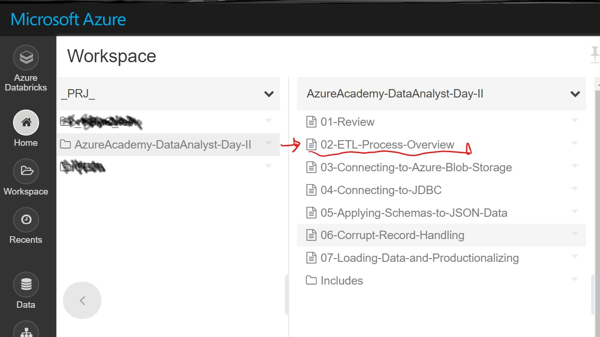

# Day#2 – AI & ML

# HOL03: Azure Databricks

This labs guides you through Azure Databricks ETL pipeline.

## Create Azure Databricks Workspace

## Sign in to the Azure portal

Sign in to the [Azure portal](https://portal.azure.com).

> [!Note]
> This tutorial cannot be carried out using **Azure Free Trial Subscription**.
> If you have a free account, go to your profile and change your subscription to **pay-as-you-go**. For more information, see [Azure free account](https://azure.microsoft.com/free/). Then, [remove the spending limit](https://docs.microsoft.com/azure/billing/billing-spending-limit#remove-the-spending-limit-in-account-center), and [request a quota increase](https://docs.microsoft.com/azure/azure-supportability/resource-manager-core-quotas-request) for vCPUs in your region. When you create your Azure Databricks workspace, you can select the **Trial (Premium - 14-Days Free DBUs)** pricing tier to give the workspace access to free Premium Azure Databricks DBUs for 14 days.

## Create an Azure Databricks workspace

In this section, you create an Azure Databricks workspace using the Azure portal.

1. In the Azure portal, select **Create a resource** > **Analytics** > **Azure Databricks**.

    

2. Under **Azure Databricks Service**, provide the values to create a Databricks workspace.

    

    Provide the following values:
    
    |Property  |Description  |
    |---------|---------|
    |**Workspace name**     | Provide a name for your Databricks workspace        |
    |**Subscription**     | From the drop-down, select your Azure subscription.        |
    |**Resource group**     | Specify whether you want to create a new resource group or use an existing one. A resource group is a container that holds related resources for an Azure solution. For more information, see [Azure Resource Group overview](../azure-resource-manager/resource-group-overview.md). |
    |**Location**     | Select **West US 2**. For other available regions, see [Azure services available by region](https://azure.microsoft.com/regions/services/).        |
    |**Pricing Tier**     |  Choose between **Standard**, **Premium**, or **Trial**. For more information on these tiers, see [Databricks pricing page](https://azure.microsoft.com/pricing/details/databricks/).       |

    Select **Pin to dashboard** and then click **Create**.

4. The workspace creation takes a few minutes. During workspace creation, you can view the deployment status in **Notifications**.

    

## Create Cluster in Azure Databricks Workspace

Databricks&reg; provides a notebook-oriented Apache Spark&trade; as-a-service workspace environment, making it easy to manage clusters and explore data interactively.

### Use cases for Apache Spark 
* Read and process huge files and data sets
* Query, explore, and visualize data sets
* Join disparate data sets found in data lakes
* Train and evaluate machine learning models
* Process live streams of data
* Perform analysis on large graph data sets and social networks

### Create a Spark cluster.

-sandbox
&nbsp;**Hint:** This step will require you navigate around Databricks while doing this lesson.  We recommend you <a href="" target="_blank">open a second browser window</a> when navigating around Databricks.  This way you can view these instructions in one window and navigate in another.

### Step 1
Databricks notebooks are backed by clusters, or networked computers that work together to process your data. Create a Spark cluster (*if you already have a running cluster, skip to **Step 2** *):
1. In your new window, click the **Clusters** button in the sidebar.

 
2. Click the **Create Cluster** button.

 
3. Name your cluster. Use your name or initials to easily differentiate your cluster from your coworkers.
4. Select the cluster type. We recommend the latest runtime (**4.0** or newer) and Scala **2.11**.
5. Specify your cluster configuration.
  * For clusters created on a **Community Edition** shard the default values are sufficient for the remaining fields.
  * For all other environments, please refer to your company's policy on creating and using clusters.  
6. Right click on **Cluster** button on left side and open a new tab. Click the **Create Cluster** button.

&nbsp;**Hint:** Check with your local system administrator to see if there is a recommended default cluster at your company to use for the rest of the class. This could save you some money!

## Import Lab files to your Azure Databricks environment
Import the `AzureAcademy-DataAnalyst-Day-II.dbc` file into your environment.

# Next Steps
Open lab notebook in `02-ETL-Process-Overview` inside the Azure Academy lab folder you just imported.

&copy; 2019 Databricks, Inc. All rights reserved. 
Apache, Apache Spark, Spark and the Spark logo are trademarks of the <a href="http://www.apache.org/">Apache Software Foundation</a>. 
 
<a href="https://databricks.com/privacy-policy">Privacy Policy</a> | <a href="https://databricks.com/terms-of-use">Terms of Use</a> | <a href="http://help.databricks.com/">Support</a>

