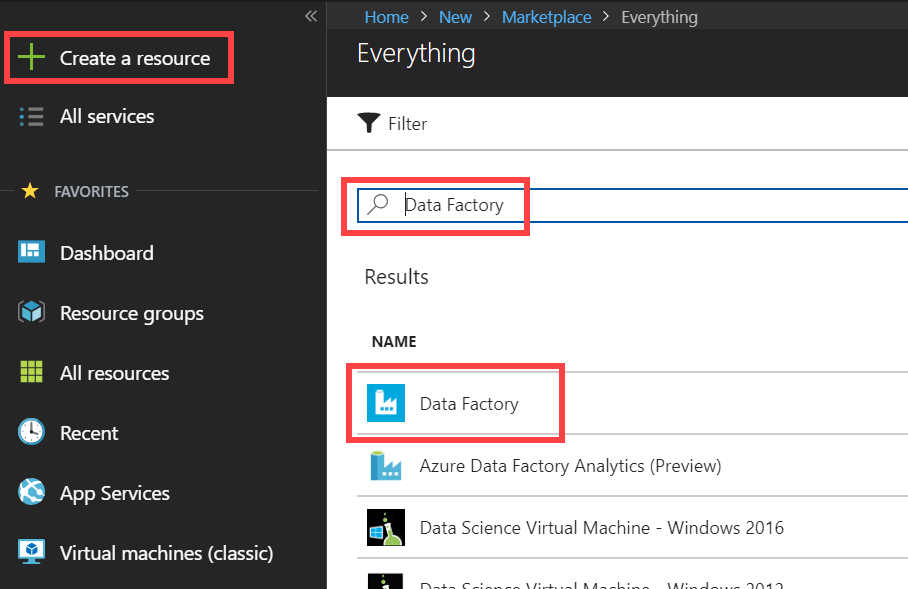

# HOL06: Modern Data Warehouse pattern - short - Preparation

## Abstract

This hands-on lab is designed to provide exposure to many of Microsoft's transformative line of business applications built using Microsoft big data and advanced analytics. 
The goal is to show an end-to-end solution, leveraging many of these technologies, but not necessarily doing work in every component possible.

> This is a shorter version of the original Microsoft Cloud Workshop session for **Big data and visualization**. The original content can be found at: https://github.com/microsoft/MCW-Big-data-and-visualization

**Disclaimer**

Information in this document, including URL and other Internet Web site references, is subject to change without notice. Unless otherwise noted, the example companies, organizations, products, domain names, e-mail addresses, logos, people, places, and events depicted herein are fictitious, and no association with any real company, organization, product, domain name, e-mail address, logo, person, place or event is intended or should be inferred. Complying with all applicable copyright laws is the responsibility of the user. Without limiting the rights under copyright, no part of this document may be reproduced, stored in or introduced into a retrieval system, or transmitted in any form or by any means (electronic, mechanical, photocopying, recording, or otherwise), or for any purpose, without the express written permission of Microsoft Corporation.

Microsoft may have patents, patent applications, trademarks, copyrights, or other intellectual property rights covering subject matter in this document. Except as expressly provided in any written license agreement from Microsoft, the furnishing of this document does not give you any license to these patents, trademarks, copyrights, or other intellectual property.

The names of manufacturers, products, or URLs are provided for informational purposes only and Microsoft makes no representations and warranties, either expressed, implied, or statutory, regarding these manufacturers or the use of the products with any Microsoft technologies. The inclusion of a manufacturer or product does not imply endorsement of Microsoft of the manufacturer or product. Links may be provided to third party sites. Such sites are not under the control of Microsoft and Microsoft is not responsible for the contents of any linked site or any link contained in a linked site, or any changes or updates to such sites. Microsoft is not responsible for webcasting or any other form of transmission received from any linked site. Microsoft is providing these links to you only as a convenience, and the inclusion of any link does not imply endorsement of Microsoft of the site or the products contained therein.

© 2020 Microsoft Corporation. All rights reserved.

Microsoft and the trademarks listed at <https://www.microsoft.com/en-us/legal/intellectualproperty/Trademarks/Usage/General.aspx> are trademarks of the Microsoft group of companies. All other trademarks are property of their respective owners.

**Contents**

<!-- TOC -->

- [Big data and visualization before the hands-on lab setup guide](#big-data-and-visualization-before-the-hands-on-lab-setup-guide)
  - [Requirements](#requirements)
  - [Before the hands-on lab](#before-the-hands-on-lab)
    - [Task 1: Provision Azure Databricks](#task-1-provision-azure-databricks)
    - [Task 2: Create Azure Storage account](#task-2-create-azure-storage-account)
    - [Task 3: Create storage container](#task-3-create-storage-container)
    - [Task 4: Provision Azure Data Factory](#task-4-provision-azure-data-factory)
    - [Task 5: Download and install Power BI Desktop](#task-5-download-and-install-power-bi-desktop)
    - [Task 6: Provision Azure Synapse](#task-6-provision-azure-synapse)

<!-- /TOC -->

# Big data and visualization before the hands-on lab setup guide

## Requirements

1. Microsoft Azure subscription must be pay-as-you-go or MSDN.

    a. Trial subscriptions will not work.

## Before the hands-on lab

Duration: 30 minutes

In this exercise, you will set up your environment for use in the rest of the hands-on lab. You should follow all the steps provided in the Before the Hands-on Lab section to prepare your environment _before_ attending the hands-on lab.

### Task 1: Provision Azure Databricks

Azure Databricks is an Apache Spark-based analytics platform optimized for Azure. It will be used in this lab to build and train a machine learning model used to predict flight delays.

> **Note**: To view the Azure portal menu, select the menu icon in the upper left-hand corner.

1. In the [Azure Portal](https://portal.azure.com) (https://portal.azure.com), select **+ Create a resource** within the portal menu, then type "Azure Databricks" into the search bar. Select Azure Databricks from the results.

   

2. Select **Create**.

3. Set the following configuration on the Azure Databricks Service creation form:

   - **Subscription**: Select the subscription you are using for this hands-on lab.
  
   - **Resource Group**: Select **Create new** and enter a unique name, such as `hands-on-lab-bigdata`

   - **Workspace name**: Enter a unique name, this is indicated by a green checkmark.
  
   - **Location**: Select a region close to you. **_(If you are using an Azure Pass, select South Central US.)_**

   - **Pricing**: Select **Premium (+ Role-based access controls)**

   

4. Select **Review + Create**.

5. Wait for validation to pass, then select **Create**.

### Task 2: Create Azure Storage account

Create a new Azure Storage account that will be used to store historic and scored flight and weather data sets for the lab.

1. In the [Azure Portal](https://portal.azure.com) (<https://portal.azure.com>), select **+ Create a resource**, then type "storage" into the search bar. Select **Storage account** from the results.

   

2. Select **Create**.

3. Set the following configuration on the Azure Storage account creation form:

   - **Subscription**: Select the subscription you are using for this hands-on lab.

   - **Resource group**: Select the same resource group you created at the beginning of this lab.

   - **Storage account name**: Enter a unique name, this is indicated by a green checkmark.

   - **Location**: Select the same region you used for Azure Databricks.

   - **Performance**: **Standard**

   - **Account kind**: **BlobStorage**

   - **Replication**: **Read-access geo-redundant storage (RA-GRS)**

   - **Access tier**: **Hot**

   

4. Select **Review + create**.

5. Wait for validation to pass, then select **Create**.

### Task 3: Create storage container

In this task, you will create a storage container in which you will store your flight and weather data files.

1. From the side menu in the Azure portal, choose **Resource groups**, then enter your resource group name into the filter box, and select it from the list.

2. Next, select your lab Azure Storage account from the list.

   

3. Select **Containers** (1) from the menu. Select **+ Container** (2) on the Containers blade, enter **sparkcontainer** for the name (3), leaving the public access level set to Private. Select **Create** (4) to create the container.

   

4. Repeat previous step to create **dwtemp** container.

### Task 4: Provision Azure Data Factory

Create a new Azure Data Factory instance that will be used to orchestrate data transfers for analysis.

1. In the [Azure Portal](https://portal.azure.com) (<https://portal.azure.com>), select **+ Create a resource**, then type "Data Factory" into the search bar. Select **Data Factory** from the results.

   

2. Select **Create**.

3. Set the following configuration on the Data Factory creation form:

   - **Name**: Enter a unique name, this is indicated by a green checkmark.

   - **Subscription**: Select the subscription you are using for this hands-on lab.

   - **Resource Group**: Select the same resource group you created at the beginning of this lab.

   - **Version**: Select **V2**

   - **Location**: Select any region close to you.

   - **Enable GIT**: **Unchecked**

   **_Understanding Data Factory Location:_**
   The Data Factory location is where the metadata of the data factory is stored and where the triggering of the pipeline is initiated from. Meanwhile, a data factory can access data stores and compute services in other Azure regions to move data between data stores or process data using compute services. This behavior is realized through the [globally available IR](https://azure.microsoft.com/en-us/global-infrastructure/services/?products=data-factory) to ensure data compliance, efficiency, and reduced network egress costs.

   The IR Location defines the location of its back-end compute, and essentially the location where the data movement, activity dispatching, and SSIS package execution are performed. The IR location can be different from the location of the data factory it belongs to.

   

4. Select **Create** to finish and submit.

### Task 5: Download and install Power BI Desktop

Power BI desktop is required to make a connection to your Azure Databricks environment when creating the Power BI dashboard.

1. Download and install [Power BI Desktop](https://powerbi.microsoft.com/desktop/).

### Task 6: Provision Azure Synapse

**Create and query a Synapse SQL pool using the Azure portal**

Quickly create and query a Synapse SQL pool (data warehouse) in Azure Synapse Analytics (formerly SQL DW) using the Azure portal.

#### Prerequisites

1. If you don't have an Azure subscription, create a [free](https://azure.microsoft.com/free/) account before you begin.

   > [!NOTE]
   > Creating a SQL pool in Azure Synapse may result in a new billable service. For more information, see [Azure Synapse Analytics pricing](https://azure.microsoft.com/pricing/details/synapse-analytics/).

#### Sign in to the Azure portal

Sign in to the [Azure portal](https://portal.azure.com/).

#### Create a SQL pool

Data warehouses are created using SQL pool in Azure Synapse Analytics. A SQL pool is created with a defined set of [compute resources](memory-concurrency-limits.md). The database is created within an [Azure resource group](../../azure-resource-manager/management/overview.md?toc=/azure/synapse-analytics/sql-data-warehouse/toc.json&bc=/azure/synapse-analytics/sql-data-warehouse/breadcrumb/toc.json) and in a [logical SQL server](../../azure-sql/database/logical-servers.md?toc=/azure/synapse-analytics/sql-data-warehouse/toc.json&bc=/azure/synapse-analytics/sql-data-warehouse/breadcrumb/toc.json).

Follow these steps to create a SQL pool that contains the **AdventureWorksDW** sample data.

1. select **Create a resource** in the upper left-hand corner of the Azure portal.

   

2. Select **Databases** on the **New** page, and select **Azure Synapse Analytics (formerly SQL DW)** in the **Featured** list.

   

3. In **Basics**, provide your subscription, resource group, SQL pool name, and server name:

   | Setting | Suggested value | Description |
   | :------ | :-------------- | :---------- |
   | **Subscription** | Your subscription | For details about your subscriptions, see [Subscriptions](https://account.windowsazure.com/Subscriptions). |
   | **Resource group** | myResourceGroup | For valid resource group names, see [Naming rules and restrictions](/azure/architecture/best-practices/resource-naming?toc=/azure/synapse-analytics/sql-data-warehouse/toc.json&bc=/azure/synapse-analytics/sql-data-warehouse/breadcrumb/toc.json). |
   | **SQL pool name** | Any globally unique name  (An example is *mySampleDataWarehouse*) | For valid database names, see [Database Identifiers](/sql/relational-databases/databases/database-identifiers?toc=/azure/synapse-analytics/sql-data-warehouse/toc.json&bc=/azure/synapse-analytics/sql-data-warehouse/breadcrumb/toc.json&view=azure-sqldw-latest). Note, a SQL pool is one type of database. |
   | **Server** | Any globally unique name | Select existing server, or create a new server name, select **Create new**. For valid server names, see [Naming rules and restrictions](/azure/architecture/best-practices/resource-naming?toc=/azure/synapse-analytics/sql-data-warehouse/toc.json&bc=/azure/synapse-analytics/sql-data-warehouse/breadcrumb/toc.json). |

   

4. Under **Performance level**, select **Select performance level** to optionally change your configuration with a slider. For the workshop DW200 is sufficient.

     

   For more information about performance levels, see [Manage compute in Azure Synapse Analytics](sql-data-warehouse-manage-compute-overview.md).

5. Select **Additional Settings**, under **Use existing data**, choose **Sample** so that AdventureWorksDW will be created as the sample database.

     

6. Now that you've completed the Basics tab of the Azure Synapse Analytics form, select **Review + Create** and then **Create** to create the SQL pool. Provisioning takes a few minutes.

   

   

7. On the toolbar, select **Notifications** to monitor the deployment process.

   

#### Create a server-level firewall rule

The Azure Synapse service creates a firewall at the server-level. This firewall prevents external applications and tools from connecting to the server or any databases on the server. To enable connectivity, you can add firewall rules that enable connectivity for specific IP addresses. Follow these steps to create a [server-level firewall rule](../../azure-sql/database/firewall-configure.md?toc=/azure/synapse-analytics/sql-data-warehouse/toc.json&bc=/azure/synapse-analytics/sql-data-warehouse/breadcrumb/toc.json) for your client's IP address.

> [!NOTE]
> Azure Synapse communicates over port 1433. If you are trying to connect from within a corporate network, outbound traffic over port 1433 might not be allowed by your network's firewall. If so, you cannot connect to your server unless your IT department opens port 1433.

1. After the deployment completes, select **All services** from the left-hand menu. Select **Databases**, select the star next to **Azure Synapse Analytics** to add Azure Synapse Analytics to your favorites.

2. Select **Azure Synapse Analytics** from the left-hand menu and then select **mySampleDataWarehouse** on the **Azure Synapse Analytics** page. The overview page for your database opens, showing you the fully qualified server name (such as **sqlpoolservername.database.windows.net**) and provides options for further configuration.

3. Copy this fully qualified server name for use to connect to your server and its databases in this and other quick starts. To open server settings, select the server name.

   

4. Select **Show firewall settings**.

   

5. The **Firewall settings** page for the server opens.

   

6. To add your current IP address to a new firewall rule, select **Add client IP** on the toolbar. A firewall rule can open port 1433 for a single IP address or a range of IP addresses.

7. select **Save**. A server-level firewall rule is created for your current IP address opening port 1433 on the server.

8. select **OK** and then close the **Firewall settings** page.

You can now connect to the server and its SQL pools using this IP address. The connection works from SQL Server Management Studio or another tool of your choice. When you connect, use the ServerAdmin account you created previously.

> [!IMPORTANT]
> By default, access through the SQL Database firewall is enabled for all Azure services. select **OFF** on this page and then select **Save** to disable the firewall for all Azure services.

#### Get the fully qualified server name

Get the fully qualified server name for your server in the Azure portal. Later you use the fully qualified name when connecting to the server.

1. Sign in to the [Azure portal](https://portal.azure.com/).

2. Select **Azure Synapse Analytics** from the left-hand menu, and select your  on the **Azure Synapse Analytics** page.

3. In the **Essentials** pane in the Azure portal page for your database, locate and then copy the **Server name**. In this example, the fully qualified name is sqlpoolservername.database.windows.net.

    

You should follow all these steps provided _before_ attending the Hands-on lab.
