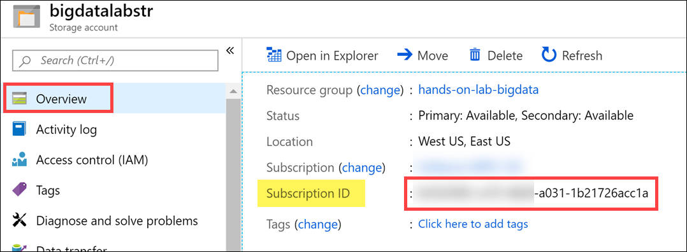
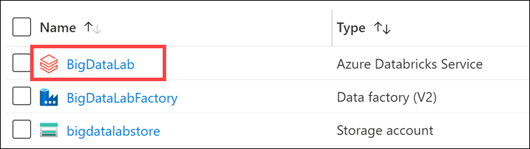
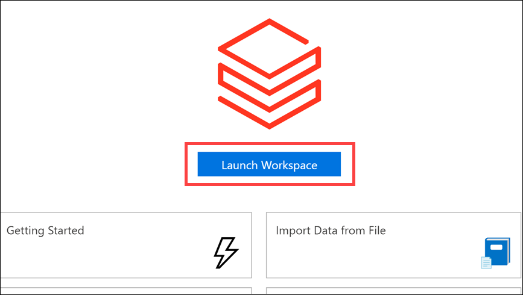
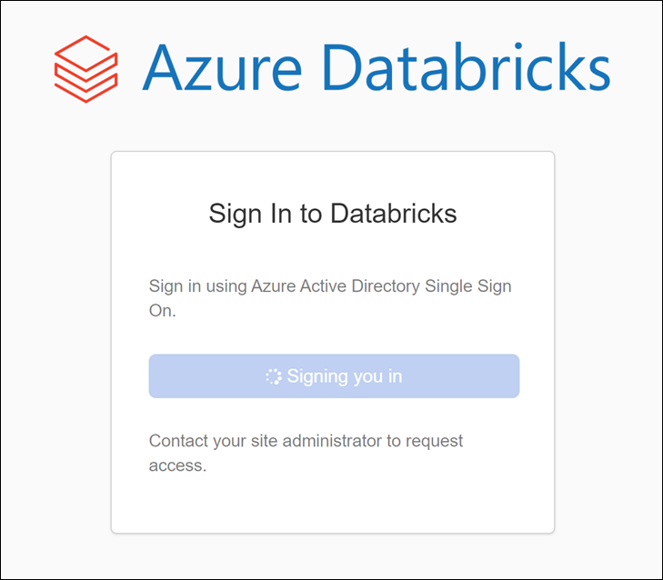
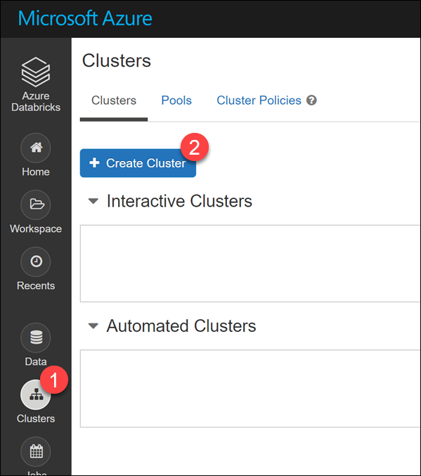
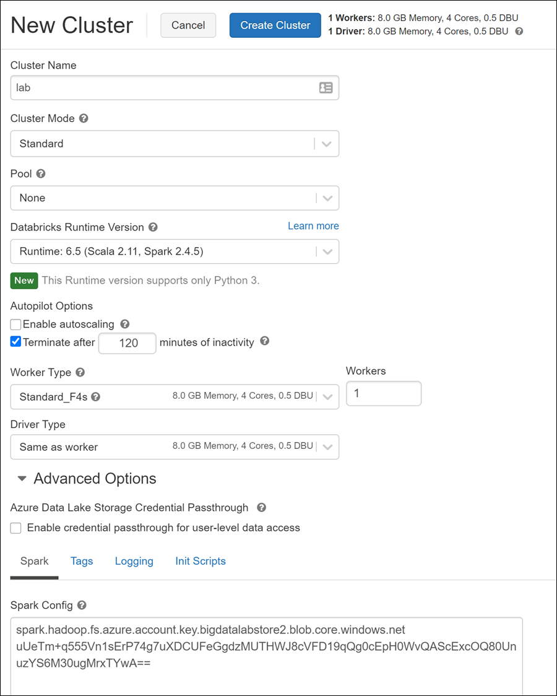

# HOL06: Modern Data Warehouse pattern - short

## Abstract

This hands-on lab is designed to provide exposure to many of Microsoft's transformative line of business applications built using Microsoft big data and advanced analytics. 
The goal is to show an end-to-end solution, leveraging many of these technologies, but not necessarily doing work in every component possible.

## Solution architecture

Below is a diagram of the solution architecture you will build in this lab. Please study this carefully so you understand the whole of the solution as you are working on the various components.

> This is a shorter version of the original Microsoft Cloud Workshop session for **Big data and visualization**. The original content can be found at: https://github.com/microsoft/MCW-Big-data-and-visualization

**Disclaimer**

Information in this document, including URL and other Internet Web site references, is subject to change without notice. Unless otherwise noted, the example companies, organizations, products, domain names, e-mail addresses, logos, people, places, and events depicted herein are fictitious, and no association with any real company, organization, product, domain name, e-mail address, logo, person, place or event is intended or should be inferred. Complying with all applicable copyright laws is the responsibility of the user. Without limiting the rights under copyright, no part of this document may be reproduced, stored in or introduced into a retrieval system, or transmitted in any form or by any means (electronic, mechanical, photocopying, recording, or otherwise), or for any purpose, without the express written permission of Microsoft Corporation.

Microsoft may have patents, patent applications, trademarks, copyrights, or other intellectual property rights covering subject matter in this document. Except as expressly provided in any written license agreement from Microsoft, the furnishing of this document does not give you any license to these patents, trademarks, copyrights, or other intellectual property.

The names of manufacturers, products, or URLs are provided for informational purposes only and Microsoft makes no representations and warranties, either expressed, implied, or statutory, regarding these manufacturers or the use of the products with any Microsoft technologies. The inclusion of a manufacturer or product does not imply endorsement of Microsoft of the manufacturer or product. Links may be provided to third party sites. Such sites are not under the control of Microsoft and Microsoft is not responsible for the contents of any linked site or any link contained in a linked site, or any changes or updates to such sites. Microsoft is not responsible for webcasting or any other form of transmission received from any linked site. Microsoft is providing these links to you only as a convenience, and the inclusion of any link does not imply endorsement of Microsoft of the site or the products contained therein.

© 2020 Microsoft Corporation. All rights reserved.

Microsoft and the trademarks listed at https://www.microsoft.com/en-us/legal/intellectualproperty/Trademarks/Usage/General.aspx are trademarks of the Microsoft group of companies. All other trademarks are property of their respective owners.

**Contents**

<!-- TOC -->

- [Big data and visualization hands-on lab step-by-step](#big-data-and-visualization-hands-on-lab-step-by-step)
  - [Abstract and learning objectives](#abstract-and-learning-objectives)
  - [Overview](#overview)
  - [Solution architecture](#solution-architecture)
  - [Requirements](#requirements)
  - [Exercise 1: Retrieve lab environment information and create Databricks cluster](#exercise-1-retrieve-lab-environment-information-and-create-databricks-cluster)
    - [Task 1: Retrieve Azure Storage account information and Subscription Id](#task-1-retrieve-azure-storage-account-information-and-subscription-id)
    - [Task 2: Create an Azure Databricks cluster](#task-2-create-an-azure-databricks-cluster)
  - [Exercise 2: Load Sample Data and Databricks Notebooks](#exercise-2-load-sample-data-and-databricks-notebooks)
    - [Task 1: Upload the Sample Datasets](#task-1-upload-the-sample-datasets)
    - [Task 2: Open Azure Databricks and complete lab notebooks](#task-3-open-azure-databricks-and-complete-lab-notebooks)
  - [Exercise 3: Setup Azure Data Factory](#exercise-3-setup-azure-data-factory)
    - [Task 1: Download and stage data to be processed](#task-1-download-and-stage-data-to-be-processed)
    - [Task 2: Configure Azure Data Factory](#task-2-configure-azure-data-factory)
  - [Exercise 4: Develop a data factory pipeline for data movement](#exercise-4-develop-a-data-factory-pipeline-for-data-movement)
    - [Task 1: Create copy pipeline using the Copy Data Wizard](#task-1-create-copy-pipeline-using-the-copy-data-wizard)
  - [Exercise 5: Operationalize ML scoring with Azure Databricks and Data Factory](#exercise-5-operationalize-ml-scoring-with-azure-databricks-and-data-factory)
    - [Task 1: Create Azure Databricks Linked Service](#task-1-create-azure-databricks-linked-service)
    - [Task 2: Trigger workflow](#task-2-trigger-workflow)
  - [Exercise 6: Summarize data using Azure Databricks](#exercise-6-summarize-data-using-azure-databricks)
    - [Task 1: Summarize delays by airport](#task-1-summarize-delays-by-airport)
  - [Exercise 7: Load data into Azure Synapse](#exercise-7-load-data-into-azure-synapse)
    - [Task 1: Open Azure Databricks and run lab notebook](#task-1-open-azure-databricks-and-run-lab-notebook)
    - [Task 2: View loaded data](task-2-view-loaded-data)
  - [Exercise 8: Visualizing in Power BI Desktop](#exercise-8-visualizing-in-power-bi-desktop)
    - [Task 1: Obtain the JDBC connection string to your Azure Databricks cluster](#task-1-obtain-the-jdbc-connection-string-to-your-azure-databricks-cluster)
    - [Task 2: Connect to Azure Databricks using Power BI Desktop](#task-2-connect-to-azure-databricks-using-power-bi-desktop)
    - [Task 3: Create Power BI report](#task-3-create-power-bi-report)
  - [After the hands-on lab](#after-the-hands-on-lab)
    - [Task 1: Delete resource group](#task-1-delete-resource-group)

<!-- /TOC -->

## Requirements

1. Microsoft Azure subscription must be pay-as-you-go or MSDN.

   - Trial subscriptions will not work.

2. If you are not a Service Administrator or Co-administrator for the Azure subscription, or if you are running the lab in a hosted environment, you will need to install [Visual Studio 2019 Community](https://visualstudio.microsoft.com/downloads/) with the **ASP.NET and web development** and **Azure development** workloads.

3. Follow all the steps provided in [Before the Hands-on Lab](Before%20the%20HOL%20-%20Big%20data%20and%20visualization.md).

## Exercise 1: Retrieve lab environment information and create Databricks cluster

Duration: 10 minutes

In this exercise, you will retrieve your Azure Storage account name and access key and your Azure Subscription Id and record the values to use later within the lab. You will also create a new Azure Databricks cluster.

### Task 1: Retrieve Azure Storage account information and Subscription Id

You will need to have the Azure Storage account name and access key when you create your Azure Databricks cluster during the lab. You will also need to create storage containers in which you will store your flight and weather data files.

1. From the side menu in the Azure portal, choose **Resource groups**, then enter your resource group name into the filter box, and select it from the list.

2. Next, select your lab Azure Storage account from the list.

   

3. On the left menu, select **Overview**, locate and copy your Azure **Subscription ID** and save to a text editor such as Notepad for later.

   

4. Select **Access keys** (1) from the menu. Copy the **storage account name** (2) and the **key1** key (3) and copy the values to a text editor such as Notepad for later.

   

### Task 2: Create an Azure Databricks cluster

You have provisioned an Azure Databricks workspace, and now you need to create a new cluster within the workspace. Part of the cluster configuration includes setting up an account access key to your Azure Storage account, using the Spark Config within the new cluster form. This will allow your cluster to access the lab files.

1. From the side menu in the Azure portal, select **Resource groups**, then enter your resource group name into the filter box, and select it from the list.

2. Next, select your Azure Databricks service from the list.

   

3. In the Overview pane of the Azure Databricks service, select **Launch Workspace**.

   

   Azure Databricks will automatically log you in using Azure Active Directory Single Sign On.

   

4. Select **Clusters** (1) from the menu, then select **+ Create Cluster** (2).

   

5. On the New Cluster form, provide the following:

   - **Cluster Name**: `lab`

   - **Cluster Mode**: **Standard**

   - **Pool**: Select **None**

   - **Databricks Runtime Version**: **Runtime: 7.2 ML (includes Apache Spark 3.0.0, Scala 2.12)** (**Note**: we are going to use ML runtime with respect to the Machine Learning)

   - **Enable Autoscaling**: **Uncheck** this option.

   - **Terminate after**: **Check** the box and enter `120`

   - **Worker Type**: **Standard_F4s**

   - **Driver Type**: **Same as worker**

   - **Workers**: `1`

   - **Spark Config**: Expand Advanced Options and edit the Spark Config by entering the connection information for your Azure Storage account that you copied above in Task 1. This will allow your cluster to access the lab files. Enter the following:

     `spark.hadoop.fs.azure.account.key.<STORAGE_ACCOUNT_NAME>.blob.core.windows.net <ACCESS_KEY>`, where <STORAGE_ACCOUNT_NAME> is your Azure Storage account name, and <ACCESS_KEY> is your storage access key.

   **Example:** `spark.hadoop.fs.azure.account.key.bigdatalabstore.blob.core.windows.net HD+91Y77b+TezEu1lh9QXXU2Va6Cjg9bu0RRpb/KtBj8lWQa6jwyA0OGTDmSNVFr8iSlkytIFONEHLdl67Fgxg==`

   

6. Select **Create Cluster**.

## Exercise 2: Load Sample Data and Databricks Notebooks

Duration: 60 minutes

In this exercise, you will implement a classification experiment. You will load the training data from your local machine into a dataset. Then, you will explore the data to identify the primary components you should use for prediction, and use two different algorithms for predicting the classification. You will then evaluate the performance of both algorithms and choose the algorithm that performs best. The model selected will be exposed as a web service that is integrated with the optional sample web app at the end.

### Task 1: Upload the Sample Datasets

1. Before you begin working with machine learning services, there are three datasets you need to load.

2. Download the three CSV sample datasets from here: <http://bit.ly/2wGAqrl> (If you get an error, or the page won't open, try pasting the URL into a new browser window and verify the case sensitive URL is exactly as shown). If you are still having trouble, a zip file called AdventureWorksTravelDatasets.zip is included in the lab-files folders.

3. Extract the ZIP and verify you have the following files:

   - FlightDelaysWithAirportCodes.csv
   - FlightWeatherWithAirportCodes.csv
   - AirportCodeLocationLookupClean.csv

4. Open your Azure Databricks workspace. Before continuing to the next step, verify that your new cluster is running. Do this by navigating to **Clusters** on the left-hand menu and ensuring that the state of your cluster is **Running**.

   

5. Select **Data** from the menu. Next, select **default** under Databases (if this does not appear, start your cluster). Finally, select **Add Data** above the Tables header.

   

6. Select **Upload File** under Create New Table, and then select either select or drag-and-drop the FlightDelaysWithAirportCodes.csv file into the file area. Select **Create Table with UI**.

   

7. Select your cluster to preview the table, then select **Preview Table**.

8. Change the Table Name to `flight_delays_with_airport_codes` and select the checkmark for **First row is header**. Select **Create Table**.

   

9. Repeat steps 5 through 8 for the FlightWeatherWithAirportCode.csv and AirportCodeLocationsClean.csv files, setting the name for each dataset in a similar fashion:

   - flightweatherwithairportcode_csv renamed to **flight_weather_with_airport_code**
   - airportcodelocationlookupclean_csv renamed to **airport_code_location_lookup_clean**

   

### Task 2: Open Azure Databricks and complete lab notebooks

1. Within Azure Databricks, select **Workspace** on the menu, then **Users**, then select the down arrow next to your user name. Select **Import**.

   

2. Within the Import Notebooks dialog, select Import from: **URL**, then paste the following into the URL textbox: `https://github.com/microsoft/MCW-Big-data-and-visualization/blob/master/Hands-on%20lab/lab-files/BigDataVis.dbc?raw=true`.

   

3. After importing, expand the new **BigDataVis** folder.

4. Before you begin, make sure you attach your cluster to the notebooks, using the dropdown. You will need to do this for each notebook you open. There are 5 notebooks included in the BigDataVis.dbc

   

5. Run each cell of the notebooks located in the **Exercise 2** folder (01, 02) individually by selecting within the cell, then entering **Ctrl+Enter** on your keyboard. Pay close attention to the instructions within the notebook so you understand each step of the data preparation process.
   > **do NOT run** Notebook 03 Deploy as Web Service

   

7. Do NOT run any notebooks within the Exercise 5 or 6 folders. They will be discussed later in the lab.

## Exercise 3: Setup Azure Data Factory

Duration: 20 minutes

In this exercise, you will create a baseline environment for Azure Data Factory development for further operationalization of data movement and processing. You will create a Data Factory service, and then install the Data Management Gateway which is the agent that facilitates data movement from on-premises to Microsoft Azure.

### Task 1: Download and stage data to be processed

1. Open a web browser.

2. Download the AdventureWorks sample data from <http://bit.ly/2zi4Sqa>.

3. Extract it to a new folder called **C:\\Data**.

### Task 2: Configure Azure Data Factory

1. Launch a new browser window, and navigate to the Azure portal (<https://portal.azure.com>). Once prompted, log in with your Microsoft Azure credentials. If prompted, choose whether your account is an organization account or a Microsoft account. This will be based on which account was used to provision your Azure subscription that is being used for this lab.

2. From the side menu in the Azure portal, choose **Resource groups**, then enter your resource group name into the filter box, and select it from the list.

3. Next, select your Azure Data Factory service from the list.

4. On the Data Factory Overview screen, select **Author & Monitor**.

   

5. A new page will open in another tab or new window. Within the Azure Data Factory site, select **Manage** on the menu.

   

6. Now, select **Linked Services** in the menu beneath Connections (1), then select **+ New** (2). On the New Linked Service dialog, enter the following:

   - **Name**: `AzureDatabricks`
  
   - **Connect via integration runtime**: Leave set to Default.
  
   - **Account selection method**: **From Azure subscription**
  
   - **Azure subscription**: Choose your Azure Subscription.
  
   - **Databricks workspace**: Pick your Databricks workspace to populate the Domain automatically.
  
   - **Select cluster**: **Existing interactive cluster**

   

7. Leave the form open and open your Azure Databricks workspace in another browser tab. You will generate and retrieve the Access token here.

8. In Azure Databricks, select the Account icon in the top corner of the window, then select **User Settings**.

   

9. Select **Generate New Token** under the Access Tokens tab. Enter **ADF access** for the comment and leave the lifetime at 90 days. Select **Generate**.

   

10. **Copy** the generated token and **paste it into a text editor** such as Notepad for a later step.

    

11. Switch back to your Azure Data Factory screen and paste the generated token into the **Access token** field within the form. After a moment, select your cluster underneath **Choose from existing clusters**. Select **Create**.

    

12. Switch back to Azure Databricks. Select **Workspace** in the menu. Select the **Exercise 5** folder then open notebook **01 Deploy for Batch Scoring**. Examine the content but _don't run any of the cells yet_. You need to **replace `STORAGE-ACCOUNT-NAME`** with the name of the blob storage account you copied in Exercise 1 into Cmd 4.

    

## Exercise 4: Develop a data factory pipeline for data movement

Duration: 20 minutes

In this exercise, you will create an Azure Data Factory pipeline to copy data (.CSV files) from an on-premises server (your machine) to Azure Blob Storage. The goal of the exercise is to demonstrate data movement from an on-premises location to Azure Storage (via the Integration Runtime).

### Task 1: Create copy pipeline using the Copy Data Wizard

1. Within the Azure Data Factory overview page, select **Copy Data**.

   

2. In the Copy Data properties, enter the following:

   - **Task name**: `CopyOnPrem2AzurePipeline`

   - **Task description**: (Optional) `This pipeline copies time-sliced CSV files from on-premises C:\\Data to Azure Blob Storage as a continuous job.`

   - **Task cadence or Task schedule**: Select **Run regularly on schedule**

   - **Trigger type**: **Select Schedule**

   - **Start date time (UTC)**: Enter **03/01/2018 12:00 AM**

   - **Recurrence**: Every `1`, and select **Month(s)**

   - Under the **Advanced recurrence options**, make sure you have a value of `0` in the textboxes for **Hours (UTC)** and **Minutes (UTC)**, otherwise it will fail later during Publishing.

   - End: **No End**

   

3. Select **Next**.

4. On the Source data store screen, select **+ Create new connection**.

5. Scroll through the options and select **File System**, then select **Continue**.

   

6. In the New Linked Service form, enter the following:

   - **Name**: `OnPremServer`

   - **Connect via integration runtime**: Select the Integration runtime created previously in this exercise.

   - **Host**: **C:\\Data**

   - **User name**: Use your machine's login username.

   - **Password**: Use your machine's login password.

7. Select **Test connection** to verify you correctly entered the values. Finally, select **Create**.

   

8. On the Source data store page, select **Next**.

   

9. On the **Choose the input file or folder** screen, select **Browse**, then select the **FlightsAndWeather** folder. Next, select **Load all files** under file loading behavior, check **Recursively**, then select **Next**.

   

10. On the File format settings page, select the following options:

    - **File format**: **Text format**

    - **Column delimiter**: **Comma (,)**

    - **Row delimiter**: **Auto detect (\r, \n, or \r\n)**

    - **Skip line count**: `0`

    - **First row as header**: **Checked**

    

11. Select **Next**.

12. On the Destination data store screen, select **+ Create new connection**.

13. Select **Azure Blob Storage** within the New Linked Service blade, then select **Continue**.

    

14. On the New Linked Service (Azure Blob Storage) account screen, enter the following, test your connection, and then select **Create**.

    - **Name**: `BlobStorageOutput`

    - **Connect via integration runtime**: Select your Integration Runtime.

    - **Authentication method**: Select **Account key**

    - **Account selection method**: **From Azure subscription**

    - **Storage account name**: Select the blob storage account you provisioned in the before-the-lab section.

    

15. On the Destination data store page, select **Next**.

16. From the **Choose the output file or folder** tab, enter the following:

    - **Folder path**: `sparkcontainer/FlightsAndWeather/{Year}/{Month}/`

    - **Filename**: `FlightsAndWeather.csv`

    - **Year**: **yyyy**

    - **Month**: **MM**

    - **Copy behavior**: **Merge files**

    - Select **Next**.

      

17. On the File format settings screen, select the **Text format** file format, and check the **Add header to file** checkbox, then select **Next**.

    

18. On the **Settings** screen, select **Skip incompatible rows** under Fault tolerance, and uncheck **Enable logging**. Expand Advanced settings and set Degree of copy parallelism to `10`, then select **Next**.

    

19. Review settings on the **Summary** tab, but **DO NOT choose Next**.

    

20. Scroll down on the summary page until you see the **Copy Settings** section. Select **Edit** next to **Copy Settings**.

    

21. Change the following Copy setting:

    - **Retry**: `3`

    - Select **Save**.

      

22. After saving the Copy settings, select **Next** on the Summary tab.

23. On the **Deployment** screen you will see a message that the deployment in is progress, and after a minute or two that the deployment completed. Select **Edit Pipeline** to close out of the wizard and navigate to the pipeline editing blade.

    

## Exercise 5: Operationalize ML scoring with Azure Databricks and Data Factory

Duration: 20 minutes

In this exercise, you will extend the Data Factory to operationalize the scoring of data using the previously created machine learning model within an Azure Databricks notebook.

### Task 1: Create Azure Databricks Linked Service

1. Return to, or reopen, the Author & Monitor page for your Azure Data Factory in a web browser, navigate to the Author view, and select the pipeline.

   

2. Once there, expand Databricks under Activities.

   

3. Drag the Notebook activity onto the design surface to the side of the Copy activity.

   

4. Select the Notebook activity on the design surface to display tabs containing its properties and settings at the bottom of the screen. On the **General** tab, enter `BatchScore` into the Name field.

   

5. Select the **Azure Databricks** tab, and select the Databricks linked service created before from the dropdown menu.

   

13. Switch back to your Azure Data Factory screen. Select the **Settings** tab, then browse to your **Exercise 5/01 Deploy for Batch Score** notebook into the Notebook path field.

    

14. The final step is to connect the Copy activities with the Notebook activity. Select the small green box on the side of the copy activity, and drag the arrow onto the Notebook activity on the design surface. What this means is that the copy activity has to complete processing and generate its files in your storage account before the Notebook activity runs, ensuring the files required by the BatchScore notebook are in place at the time of execution. Select **Publish All**, then **Publish**, after making the connection.

    

### Task 2: Trigger workflow

1. Switch back to Azure Data Factory. Select your pipeline if it is not already opened.

2. Select **Trigger**, then **Trigger Now** located above the pipeline design surface.

   

3. Enter `3/1/2017` into the **windowStart** parameter, then select **OK**.

   

4. Select **Monitor** in the menu. You will be able to see your pipeline activity in progress as well as the status of past runs.

   

   > **Note**: You may need to restart your Azure Databricks cluster if it has automatically terminated due to inactivity.

## Exercise 6: Summarize data using Azure Databricks

Duration: 10 minutes

In this exercise, you will prepare a summary of flight delay data using Spark SQL.

### Task 1: Summarize delays by airport

1. Open your Azure Databricks workspace, expand the **Exercise 6** folder and open the final notebook called **01 Explore Data**.

   

2. Execute each cell and follow the instructions in the notebook that explains each step.

## Exercise 7: Load data into Azure Synapse

Duration: 20 minutes

In this exercise, you will connect from Databricks directly to Azure Synapse and perform direct load of prediction dataframe into SQL table.

### Task 1: Open Azure Databricks and run lab notebook

In the Databricks notebook please fill/update accordingly necessary variables, such as `storageAccountName`, `sqlDwServerName` etc.

### Task 2: View loaded data

Navigate to the Synapse Analytics Workspace and review the loaded data in the database table. Alternatively, you can open your tool of choice - SQL Server Management Studio, Azure Data Studio, etc. to perform this operation.

 

## Exercise 8: Visualizing in Power BI Desktop

Duration: 20 minutes

In this exercise, you will create visualizations in Power BI Desktop.

### Task 1: Obtain the JDBC connection string to your Azure Databricks cluster

Before you begin, you must first obtain the JDBC connection string to your Azure Databricks cluster.

1. In Azure Databricks, go to Clusters and select your cluster.

2. On the cluster edit page, scroll down to the bottom of the page, expand **Advanced Options**, then select the **JDBC/ODBC** tab.

   

3. On the **JDBC/ODBC** tab, copy and save the first JDBC URL.

   - Construct the JDBC server address that you will use when you set up your Spark cluster connection in Power BI Desktop.

   - Take the JDBC URL and do the following:

   - Replace `jdbc:spark` with `https`.

   - Remove everything in the path between the port number and sql, retaining the components indicated by the boxes in the image below. Also remove `;AuthMech=3;UID=token;PWD=<personal-access-token>` from the end of the string.

      

   - In our example, the server address would be:

      <https://adb-6784833592075405.5.azuredatabricks.net:443/sql/protocolv1/o/6784833592075405/0615-225254-need937>

### Task 2: Connect to Azure Databricks using Power BI Desktop

1. If you did not already do so during the before the hands-on lab setup, download Power BI Desktop from <https://powerbi.microsoft.com/en-us/desktop/>.

2. When Power BI Desktop starts, you will need to enter your personal information, or Sign in if you already have an account.

   

3. Select Get data on the screen that is displayed next.

   

4. Select **Spark** from the list of available data sources. You may enter Spark into the search field to find it faster.

   

5. Select **Connect**.

6. On the next screen, you will be prompted for your Spark cluster information.

7. Paste the JDBC connection string you constructed  into the **Server** field.

8. Select the **HTTP** protocol.

9. Select **DirectQuery** for the Data Connectivity mode, and select **OK**. This option will offload query tasks to the Azure Databricks Spark cluster, providing near-real time querying.

   

10. Enter your credentials on the next screen as follows:

    - **User name**: `token`

    - **Password**: Remember that ADF Access token we generated for the Azure Data Factory notebook activity? Paste the same value here for the password.

    

    

11. Select **Connect**.

12. In the Navigator dialog, check the box next to **flight_delays_summary**, and select **Load**.

    

### Task 3: Create Power BI report

1. Once the data finishes loading, you will see the fields appear on the far side of the Power BI Desktop client window.

   

2. From the Visualizations area, next to Fields, select the Globe icon to add a Map visualization to the report design surface.

   

3. With the Map visualization still selected, drag the **OriginLatLong** field to the **Location** field under Visualizations. Then Next, drag the **NumDelays** field to the **Size** field under Visualizations.

   

4. You should now see a map that looks similar to the following (resize and zoom on your map if necessary):

   

5. Unselect the Map visualization by selecting the white space next to the map in the report area.

6. From the Visualizations area, select the **Stacked Column Chart** icon to add a bar chart visual to the report's design surface.

   

7. With the Stacked Column Chart still selected, drag the **DayofMonth** field and drop it into the **Axis** field located under Visualizations.

8. Next, drag the **NumDelays** field over, and drop it into the **Value** field.

   

9. Grab the corner of the new Stacked Column Chart visual on the report design surface, and drag it out to make it as wide as the bottom of your report design surface. It should look something like the following.

   

10. Unselect the Stacked Column Chart visual by selecting on the white space next to the map on the design surface.

11. From the Visualizations area, select the Treemap icon to add this visualization to the report.

    

12. With the Treemap visualization selected, drag the **OriginAirportCode** field into the **Group** field under Visualizations.

13. Next, drag the **NumDelays** field over, and drop it into the **Values** field.

    

14. Grab the corner of the Treemap visual on the report design surface, and expand it to fill the area between the map and the side edge of the design surface. The report should now look similar to the following.

    

15. You can cross filter any of the visualizations on the report by selecting one of the other visuals within the report, as shown below (This may take a few seconds to change, as the data is loaded).

    

16. You can save the report, by choosing Save from the File menu, and entering a name and location for the file.

    

## After the hands-on lab

Duration: 10 minutes

In this exercise, attendees will deprovision any Azure resources that were created in support of the lab.

### Task 1: Delete resource group

1. Using the Azure portal, navigate to the Resource group you used throughout this hands-on lab by selecting **Resource groups** in the menu.

2. Search for the name of your research group and select it from the list.

3. Select **Delete** in the command bar and confirm the deletion by re-typing the Resource group name and selecting **Delete**.

You should follow all steps provided _after_ attending the Hands-on lab.
