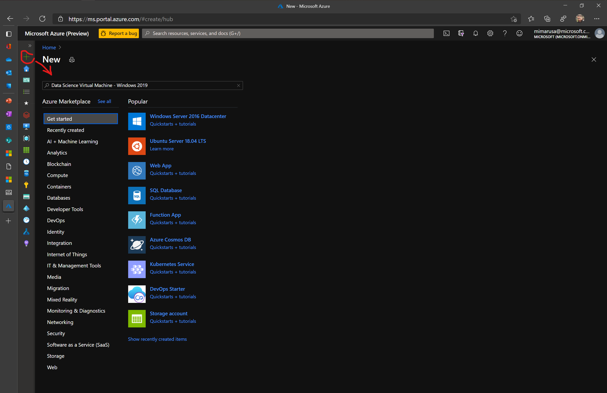
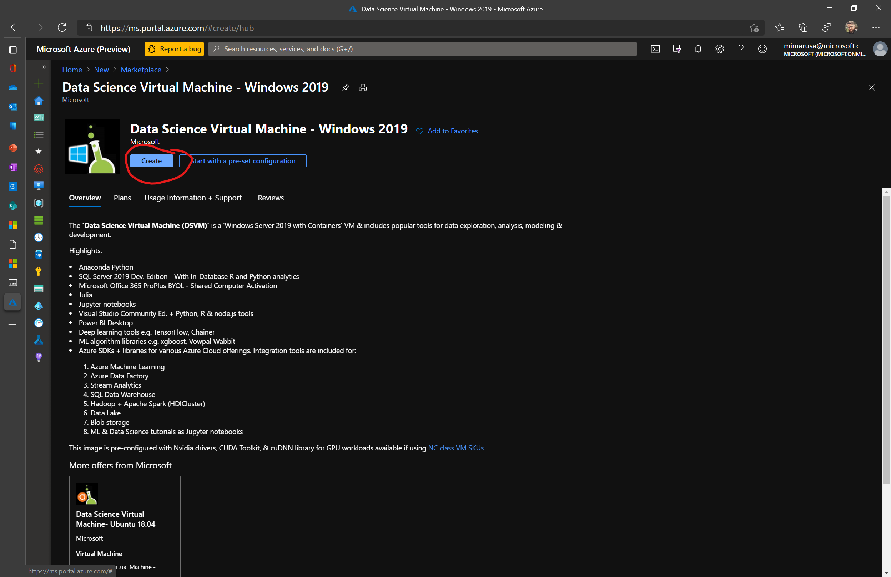
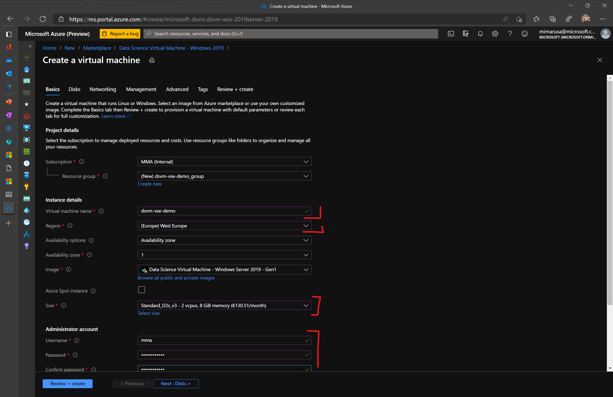
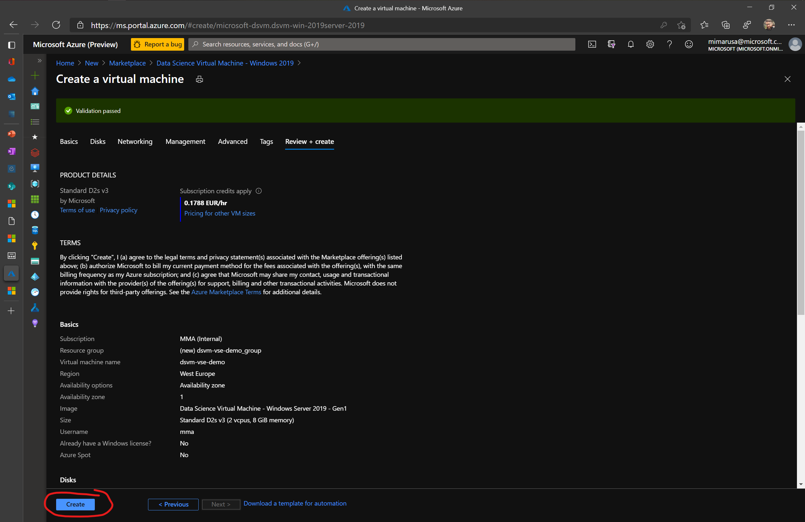
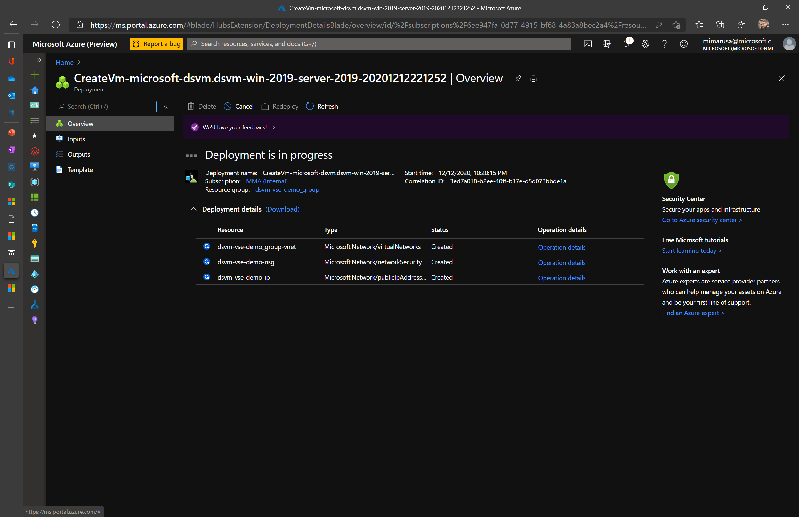
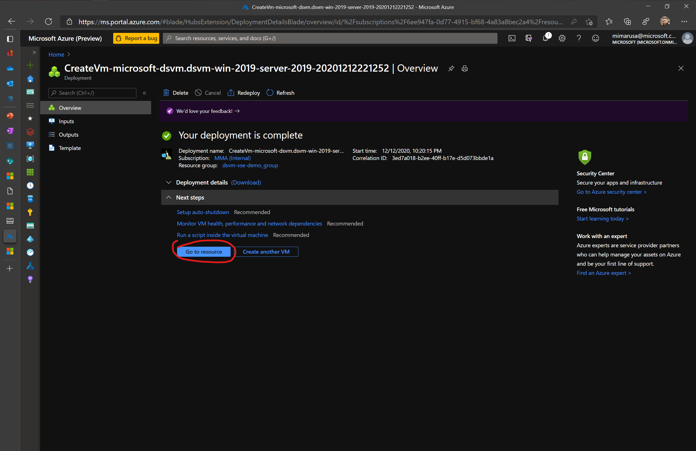
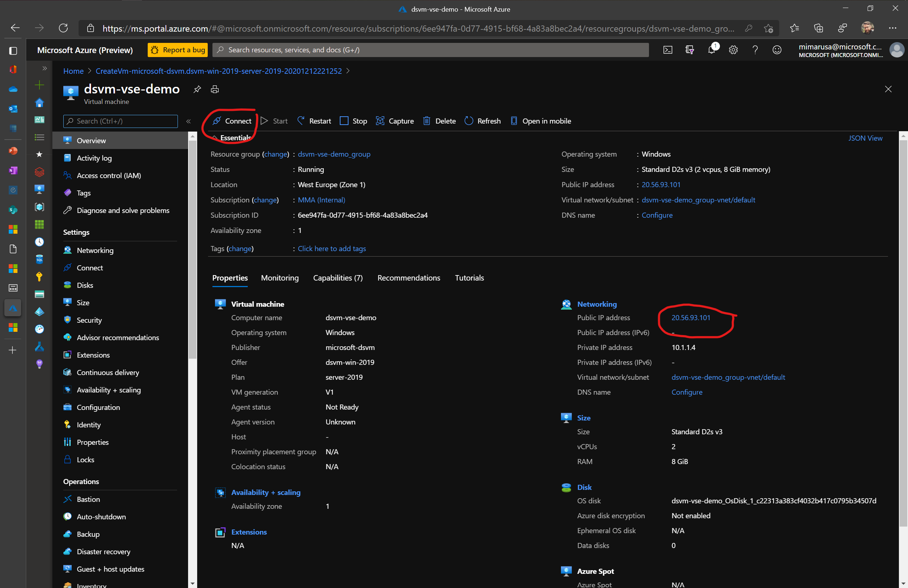
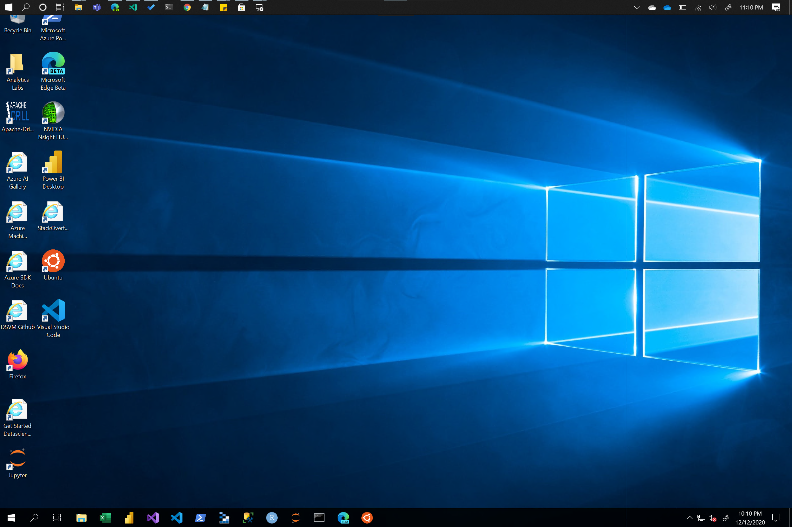

# Data Science Virtual Machine lab

In this lab you will provision Data Science Virtual Machine, a comprehensive pre-configured virtual machines for data science modelling, development and deployment.

## Provision / Setup the VM in Azure Portal

1. Open Azure Portal [https://portal.azure.com/](https://portal.azure.com/)
1. Create new resource by clicking on the **+** sign (top left) and then write "data science virtual machine"

1. Select "Data Science Virtual Machine - Windows 2019" and hit **Create** button

1. You need to specify following info to create VM for this lab - leave everyting else in defaults:

|parameter|value|
|---------|-----|
|Virtual machine name|chose_your_name|
|Region|West Europe|
|Size|for this lab Standard_D2s_v3|
|Username|choose one as local account in VM|
|Password|choose your password| 

> note: the username/pass will be used for connection to the VM

5. Click next (leve everything in defaults) until you reach last page - hit **Create**

1. Now your DSVM is being provisioned - check status
 
1. After succesfull creation click **go to resource** (this will brign you the VM details)
 
1. Check the details - Public IP or hit **Connect** which will open the Remote Desktop Connection -> use your credentials to login (entered previously)

1. You are now logged into DSVM and should see the Windows screen / Desktop

1. check out the pre-installed SW:
    
    - RStudio
    - Jupyter
    - VS Code
    - and many others...

**End of lab.**

