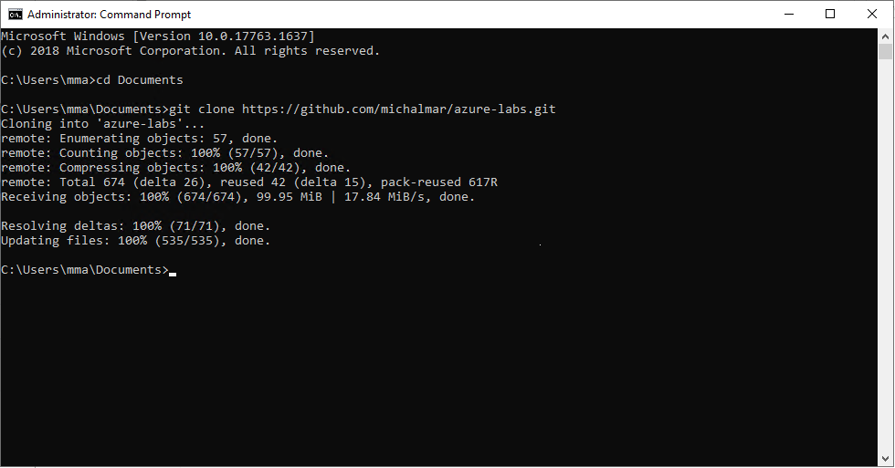

# Use R in Azure

In this lab you will use Azure Data Science Virtual Machine to access presintalled and preconfigured RStudio. And run simple training of logistic regression in the Azure VM. 

## PREREQUISITIES

- Azure Subscription
- Data Science Virtual Machine (Linux/Windows)

## Setup

## Use R in DSVM - RStudio

In case you are using **DSVM Windows**, log in using RDP and there work with preinstalled RStudio. In **Linux DSVM** open your RStudio server URL.

1. Clone repository of the labs: `git clone https://github.com/michalmar/azure-labs.git`
    - you can open CMD line tool and run the command (for Win see image below)
    
1. Open your RStudio
1. Navigate to folder `azure-labs/HOL07-AML-R`
1. Set that folder as your wokring directory in R: `setwd("~/azure-labs/HOL07-AML-R")` (you can also use GUI for that)
1. Open `train-R-only.R` in the RStudio and follow instruction from there.

