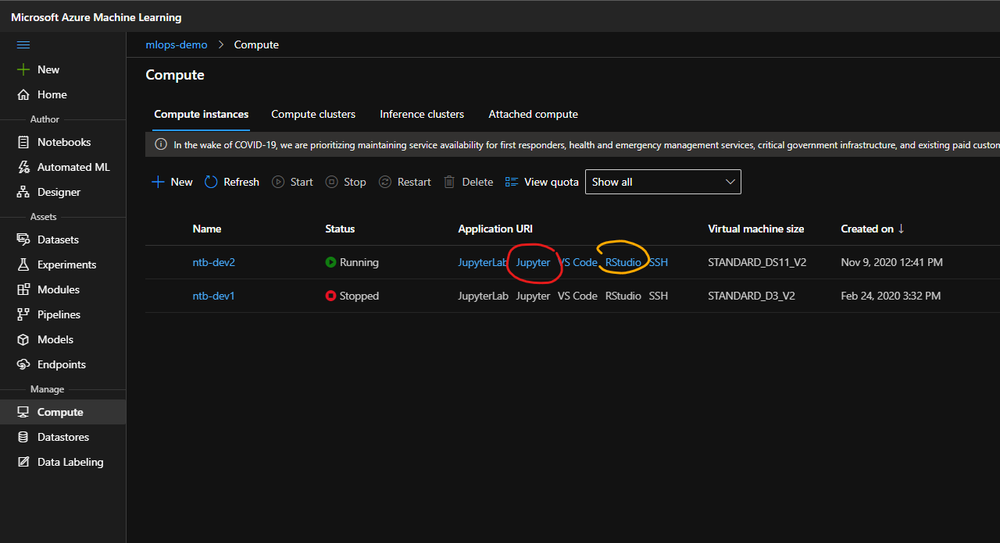

# Use AML SDK for R in Azure

In this lab you will continue ([prev lab](./02-use-plain-R.md)) to work with R modelling with Logistic Regression but this time using Azure Machine Learning, you will:
- work with Jupyter (R kernel) from AML Compute Instance
- connect to your AML Workspace
- Create / Set AML Experiment
- Run training on Remote Compute (AML Cluster)
- Examine training results in AML Studio

## PREREQUISITIES

- Azure Subscription
- Azure Machine Learning Workspace - see setup in [HOL02-AML](../HOL02-AML/README.md) for instruction on how to create and set up the AML Workspace

## Setup

## Use R in Jupyter (you can also work with RStudio)

You are expected to login to your Compute Instance Jupyter notebooks:

1. Clone repository of the labs: `git clone https://github.com/michalmar/azure-labs.git`
    - if you haven't done already see setup in [HOL02-AML](../HOL02-AML/README.md)
1. Open your Jupyter notebook `train-R-in-AML-remote-compute.ipynb`
1. Follow the instructions in the notebook - run by individual cells.

**End of lab.**

